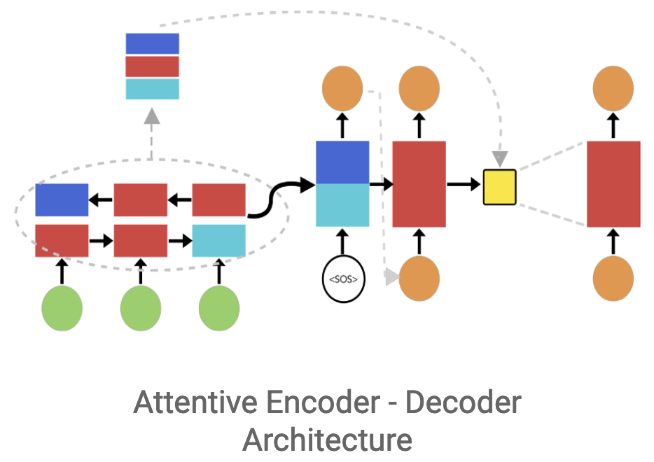

# Automated Research Paper Summarization Tool

## Project Overview

This project aims to address the challenge of navigating the vast volume of research papers by developing an automated summarization tool. Leveraging advanced Natural Language Processing (NLP) and Deep Learning technologies, this tool is designed to condense research papers into concise, informative summaries. The goal is to extract and present the core ideas effectively, handling complex academic language and diverse formats, thus aiding users in efficiently understanding and keeping up with the latest scholarly work.

## Dataset

The datasets chosen for this project are sourced from ArXiv and PubMed OpenAccess repositories, well-known for their extensive collections of long and structured documents. These datasets have been summarized and are available on HuggingFace. The data is organized into four files which include training, validation, and test datasets along with a list of related vocabularies, all packaged in a tar file totaling 5GB.

## Data Processing

### Step 1: Cleaning
- **Description**: Clean the text data by removing unnecessary elements such as numbers, URLs, and links using regular expressions (regex), which are often irrelevant for text analysis.

### Step 2: Tokenization
- **Description**: Convert the cleaned text data into tokens using the Natural Language Toolkit (NLTK). Tokenization is the process of breaking down text into words or phrases for subsequent analysis.

### Step 3: Vectorization
- **Description**: Transform tokens into numerical vectors using GloVe (Global Vectors for Word Representation). This method embeds tokens into a continuous vector space that represents their meanings.

## Core Architecture

  

The system utilizes a gated Recurrent Neural Network (RNN) architecture, specifically using Long Short-Term Memory (LSTM) networks. LSTMs are chosen to capture long-range dependencies within the text and to address the vanishing gradient issues typical of standard RNNs.

### Encoder-Decoder Structure

- **Bidirectional LSTM Encoder**: Processes input data in both forward and reverse directions to capture context from both past and future data points, creating a comprehensive representation of the input sequence.
- **Unidirectional LSTM Decoder**: Generates the output sequence step-by-step from the encoded representation. It works in one direction, predicting the next element of the sequence based on the previous elements and the context provided by the encoder.

### Attention Mechanism

- **Global Attention Mechanism**: Incorporated into the model to allow the decoder to focus on different parts of the encoder’s output during each step of the decoding process. This mechanism enhances the model's ability to recall important parts of the input sequence, leading to more accurate and contextually relevant summaries.

## Conclusion

This tool is designed to revolutionize the way individuals engage with scholarly content, providing quick, reliable, and digestible summaries of extensive research papers, thereby saving time and enhancing learning and research efficiency.

